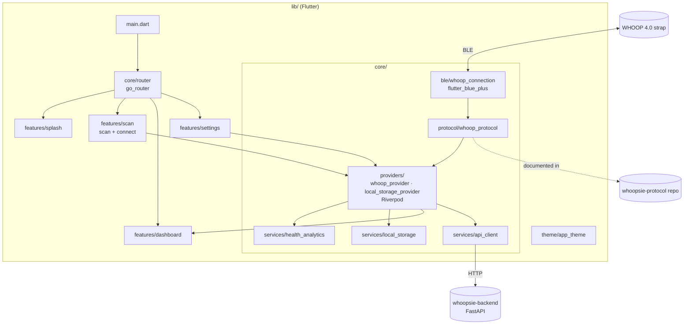

# Architecture

A Flutter companion app that speaks the native WHOOP BLE protocol. Riverpod provides state; go_router handles navigation. A separate backend repo ingests and serves metrics.

```mermaid
flowchart TD
    Strap[(WHOOP 4.0 strap)] <-->|BLE| Conn

    subgraph App["lib/ (Flutter)"]
        Main[main.dart] --> Router["core/router<br/>go_router"]
        Router --> Splash[features/splash]
        Router --> Scan[features/scan<br/>scan + connect]
        Router --> Dash[features/dashboard]
        Router --> Set[features/settings]

        subgraph Core["core/"]
            Conn["ble/whoop_connection<br/>flutter_blue_plus"]
            Proto[protocol/whoop_protocol]
            Prov["providers/<br/>whoop_provider · local_storage_provider<br/>Riverpod"]
            Ana[services/health_analytics]
            LS[services/local_storage]
            API[services/api_client]
        end
        Theme[theme/app_theme]
    end

    Conn --> Proto --> Prov
    Prov --> Ana
    Prov --> LS
    Prov --> Dash
    Scan --> Prov
    Set --> Prov
    API -->|HTTP| Backend[(whoopsie-backend<br/>FastAPI)]
    Prov --> API
    Proto -.documented in.-> Spec[(whoopsie-protocol repo)]
```
